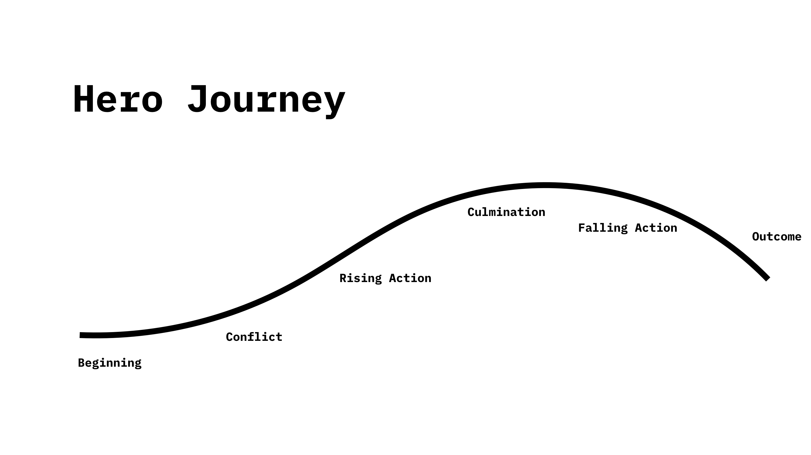

# E-Learning of Design Content
This Project is developed by Philipp Kaltofen and Jan Meininghaus during the summer term of 2018 at the University of Applied Sciences in Darmstadt. 

The goal of this Project was to identify, if it is possible to enhance the way in which you learn the basic input of design lectures but with an interactive approach. It is all wrapped into a Story, so the User can better imagine how the design process works and what the difficulties are during that process. This Story is based on the principle of the Hero Journey and its way of solving a problem. We modified a bit to our needing but in its core it is still the same structure.

The first finished prototype is all about getting to know and understanding the User of a product. 

## Goal
By making this Project Public it is our goal, to work with people together and to put effort into this project so we can slowly but steadily build up a platform for people who are interested in Design and how a Design process works. 

## What does this Repo contain?
The root of the repo is our final and finished Prototype and all its Sessions. 
The folder `previous` contains all of our previous versions and approaches. 
